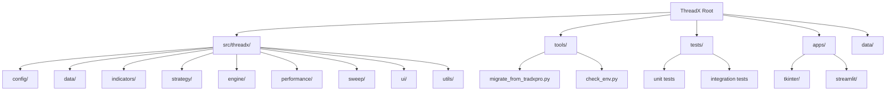
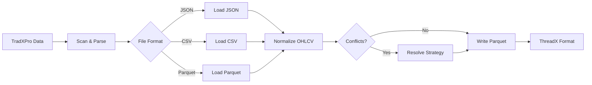

# ThreadX - Modular Trading Framework

ThreadX is a high-performance, modular backtesting and trading framework designed for Windows-first environments. Built with Python 3.10+, it provides offline-friendly operations, GPU acceleration, and comprehensive performance analysis.

[](https://www.python.org/downloads/)
[](https://www.microsoft.com/windows)
[](https://developer.nvidia.com/cuda-zone)
[](./tests/)

## 🎯 Features

- **Modular Architecture**: 10 phases from config to UI with stable APIs
- **GPU Acceleration**: RTX 5090/2060 support with CuPy integration
- **Performance First**: >1500 tasks/min with intelligent caching  
- **Windows Native**: PowerShell scripts, relative paths, no env vars
- **Offline Ready**: No internet dependencies in core operations
- **Type Safe**: Full mypy compatibility with strict type hints

## 📁 Project Structure



## 🚀 Quick Start

### Prerequisites

- **Python 3.10+** 
- **Windows 10/11** (primary platform)
- **8GB+ RAM** recommended
- **GPU (optional)**: RTX 5090, RTX 2060, or compatible CUDA device

### Installation (Offline)

1. **Clone Repository**
   ```powershell
   git clone <repository-url> ThreadX
   cd ThreadX
   ```

2. **Create Virtual Environment**
   ```powershell
   python -m venv .venv
   .\.venv\Scripts\activate
   ```

3. **Install Dependencies**
   ```powershell
   pip install -r requirements.txt
   ```
   
   For GPU support:
   ```powershell
   pip install cupy-cuda12x  # or appropriate CUDA version
   ```

4. **Verify Installation**
   ```powershell
   python tools/check_env.py
   ```

### Configuration

ThreadX uses TOML-based configuration with **no environment variables**:

```toml
# paths.toml
[paths]
data_root = "./data"
logs = "./logs"
cache = "./cache"

[gpu]
enable_gpu = true
devices = ["5090", "2060"]
load_balance = {"5090" = 0.75, "2060" = 0.25}

[performance]
target_tasks_per_min = 2500
vectorization_batch_size = 10000
```

## 🛠️ Tools & Migration

### Migration from TradXPro

Convert existing TradXPro data to ThreadX format:

```powershell
# Basic migration
python tools/migrate_from_tradxpro.py --root D:\TradXPro

# With filters and dry-run
python tools/migrate_from_tradxpro.py --root D:\TradXPro --symbols BTCUSDT,ETHUSDT --timeframes 1h,4h --dry-run

# Advanced options
python tools/migrate_from_tradxpro.py --root D:\TradXPro --resolve latest --backup-dir ./backup --report migration_report.json
```

**Migration Features:**
- ✅ JSON→Parquet conversion with canonical OHLCV schema
- ✅ Conflict resolution (latest/append/merge strategies)  
- ✅ Idempotent operations (re-run safe)
- ✅ Integrity validation with checksums
- ✅ Detailed reporting and rollback support

**Migration Flow:**


### Environment Check

Diagnose system capabilities and performance:

```powershell
# Basic check
python tools/check_env.py

# Generate JSON report
python tools/check_env.py --json env_report.json

# Strict mode (exit non-zero if issues)
python tools/check_env.py --strict

# Skip GPU tests
python tools/check_env.py --no-gpu
```

**Environment Report Includes:**
- 🖥️ System specs (CPU, RAM, disk space)
- 📦 Package versions and compatibility
- 🎮 GPU detection (RTX 5090/2060 support)
- ⚡ Performance benchmarks (NumPy, Pandas, Parquet, CuPy)
- 💡 Actionable recommendations

## 🧪 Testing

### Run Tests

```powershell
# All tests with coverage
python -m pytest tests/ --cov=src --cov=tools --cov-report=html

# Unit tests only
python -m pytest tests/ -m "not integration"

# Skip GPU tests
python -m pytest tests/ -m "not gpu"

# Phase 10 specific tests
python -m pytest tests/test_phase10.py -v
```

### Test Categories

- **Unit Tests**: Individual component testing
- **Integration Tests**: Multi-component workflows
- **End-to-End**: Full pipeline validation (Data→Strategy→Performance)
- **GPU Tests**: CuPy acceleration validation
- **Migration Tests**: TradXPro conversion scenarios

### Coverage Requirements

- **Minimum**: 80% code coverage
- **Target**: 90%+ for critical paths
- **Exclusions**: UI components, external integrations

## 📊 Phase Overview

ThreadX is built in 10 modular phases:

| Phase | Component | Description | Status |
|-------|-----------|-------------|---------|
| 1 | **Config** | TOML settings, paths, no env vars | ✅ |
| 2 | **Data** | I/O, resampling, dataset registry | ✅ |
| 3 | **Indicators** | Caching, bank.ensure() API | ✅ |
| 4 | **Strategy** | Protocol-based strategy system | ✅ |
| 5 | **Engine** | Multi-GPU orchestration, NCCL | ✅ |
| 6 | **Performance** | Metrics, plots, Sharpe analysis | ✅ |
| 7 | **Sweep** | Parameter optimization, logging | ✅ |
| 8 | **UI** | Tkinter (primary), Streamlit (fallback) | ✅ |
| 9 | **Utils** | Timing, caching, device abstraction | ✅ |
| 10 | **Tools** | Migration, tests, env check | ✅ |

### API Stability

All phases expose stable APIs with semantic versioning:

```python
# Phase 2: Data
from src.threadx.data import load_data, resample_data

# Phase 3: Indicators  
from src.threadx.indicators.bank import ensure

# Phase 5: Engine
from src.threadx.engine import run

# Phase 9: Utils
from src.threadx.utils import Timer, cached, xp
```

## 🎮 GPU Acceleration

ThreadX provides seamless CPU/GPU switching:

```python
from src.threadx.utils import xp, gpu_available

# Device-agnostic code
backend = xp()  # Returns NumPy or CuPy
data = backend.array([1, 2, 3, 4, 5])
result = backend.sum(data)

# Check GPU status
if gpu_available():
    print("🚀 GPU acceleration enabled")
else:
    print("💻 Running on CPU")
```

**GPU Support Matrix:**

| GPU Model | Memory | Load Balance | Status |
|-----------|--------|--------------|---------|
| RTX 5090 | 32GB | 75% | 🎯 Primary |
| RTX 2060 | 8GB | 25% | 🎯 Secondary |
| Other CUDA | Various | Auto | ⚠️ Experimental |

## 📈 Performance Optimization

### Benchmark Targets

- **Throughput**: >1500 tasks/minute
- **Memory**: <4GB baseline, 8GB+ recommended  
- **Cache Hit Rate**: >90% for repeated operations
- **GPU Speedup**: 10-100x for large datasets

### Optimization Techniques

1. **Vectorization**: NumPy/CuPy operations
2. **Caching**: LRU/TTL with statistics
3. **Batching**: Memory-efficient processing
4. **Threading**: BLAS configuration (OMP_NUM_THREADS=1)
5. **Memory Pools**: GPU memory reuse

### Performance Monitoring

```python
from src.threadx.utils import Timer, measure_throughput

# Time operations
with Timer() as t:
    result = expensive_operation()
print(f"Elapsed: {t.elapsed_sec:.3f}s")

# Measure throughput
@measure_throughput('my_function')
def process_data(data):
    return computation(data)
```

## 🔧 Development

### Code Standards

- **PEP-8** compliance
- **Type hints** required (mypy compatible)
- **Docstrings** for all public APIs
- **Relative paths** only (no absolute paths)
- **No environment variables** (TOML config only)

### Development Workflow

1. **Branch**: Create feature branch from `main`
2. **Code**: Implement with tests (TDD encouraged)
3. **Test**: Ensure >80% coverage
4. **Type Check**: `mypy src/ tools/`
5. **Format**: `black src/ tools/ tests/`
6. **Commit**: Conventional commits preferred

### Directory Conventions

```
ThreadX/
├── src/threadx/          # Core library
├── tools/                # CLI utilities  
├── tests/                # Test suites
├── apps/                 # UI applications
├── data/                 # Local data (gitignored)
├── logs/                 # Application logs
├── cache/                # Performance cache
└── docs/                 # Documentation
```

## 🚀 Running Applications

### Tkinter UI (Primary)

```powershell
python run_tkinter.py
```

### Streamlit UI (Import-only in tests)

```powershell
# Manual launch only (not used in automated tests)
.\.venv\Scripts\python -m streamlit run apps/streamlit/app.py --server.port 8503
```

## 🛡️ Security & Best Practices

### Security Features

- ✅ **Relative paths only** - no absolute path injection
- ✅ **Read-only data** mode available
- ✅ **Path validation** and sanitization
- ✅ **No network dependencies** in core
- ✅ **Deterministic operations** (seed=42)

### Best Practices

1. **Always use virtual environments**
2. **Keep data/ directory local and gitignored**
3. **Use TOML config instead of environment variables**  
4. **Enable GPU acceleration when available**
5. **Monitor memory usage with large datasets**
6. **Run environment checks after updates**

## 📋 CLI Reference

### Migration Tool

```powershell
python tools/migrate_from_tradxpro.py [OPTIONS]

Options:
  --root PATH                    Source TradXPro directory
  --symbols SYM1,SYM2           Filter by symbols
  --timeframes TF1,TF2          Filter by timeframes  
  --date-from YYYY-MM-DD        Start date filter
  --date-to YYYY-MM-DD          End date filter
  --dry-run                     Preview without changes
  --resolve {latest|append|merge} Conflict resolution
  --backup-dir PATH             Backup directory
  --concurrency N               Thread count
  --report PATH                 JSON report output
  --verbose                     Detailed logging

Exit Codes:
  0    Success
  1    Errors occurred
```

### Environment Check

```powershell
python tools/check_env.py [OPTIONS]

Options:
  --json PATH           JSON report output
  --strict              Exit non-zero if critical issues
  --no-gpu              Skip GPU detection/benchmarks
  --verbose             Detailed logging

Exit Codes:
  0    All checks passed
  1    Critical issues found (--strict only)
```

## 🤝 Contributing

1. **Fork** the repository
2. **Create** feature branch (`git checkout -b feature/amazing-feature`)
3. **Commit** changes (`git commit -m 'Add amazing feature'`)
4. **Push** to branch (`git push origin feature/amazing-feature`)
5. **Open** Pull Request

### Contribution Guidelines

- Follow existing code style and patterns
- Add tests for new functionality (maintain 80%+ coverage)
- Update documentation for user-facing changes
- Ensure all CI checks pass
- Use conventional commit messages

## 📝 License

This project is licensed under the MIT License - see the [LICENSE](LICENSE) file for details.

## 🙏 Acknowledgments

- **NumPy/CuPy** communities for array computing excellence
- **Pandas** team for data manipulation foundations  
- **PyArrow** project for efficient columnar storage
- **Plotly** for interactive visualization capabilities
- **Streamlit** and **Tkinter** for UI frameworks

## 📞 Support

- **Documentation**: Check this README and inline docstrings
- **Environment Issues**: Run `python tools/check_env.py --verbose`
- **Migration Problems**: Use `--dry-run` and `--verbose` flags
- **Performance**: Monitor with built-in timing decorators
- **GPU Issues**: Verify CUDA installation and CuPy compatibility

---

**ThreadX** - Built for performance, designed for reliability, optimized for Windows.
